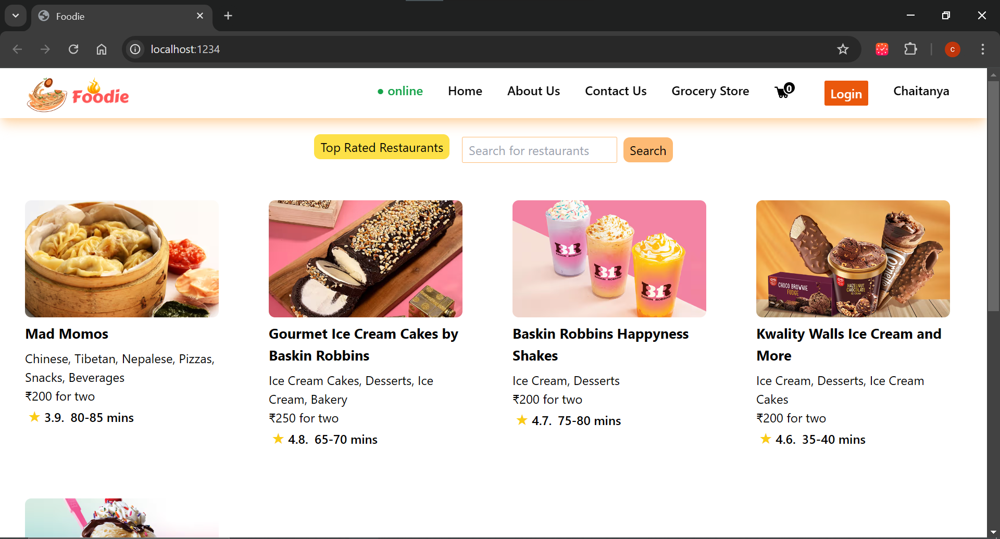
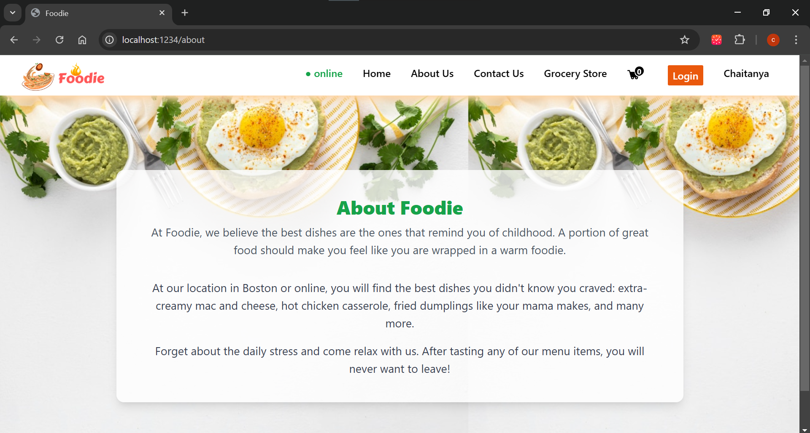
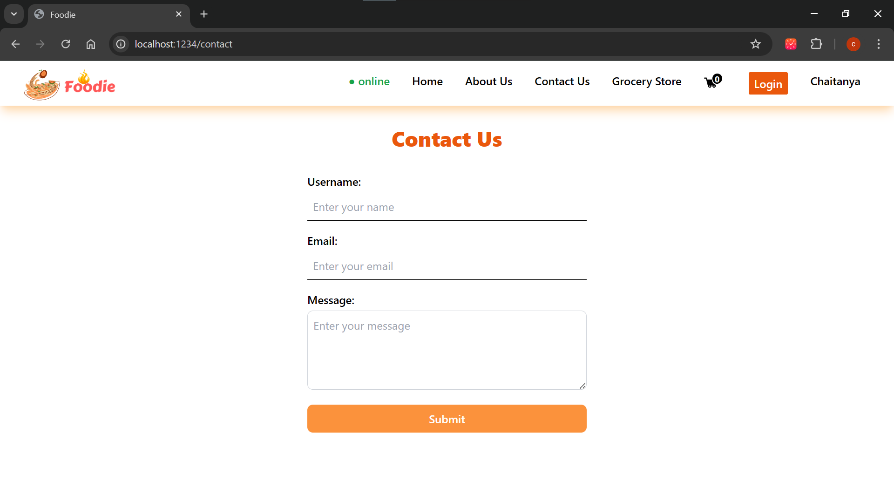
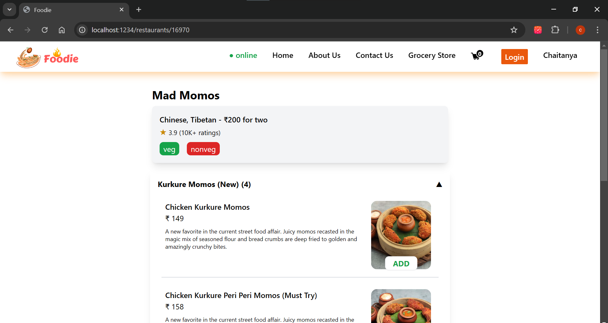

# Foodie Restaurant Website

Welcome to the Foodie Restaurant Website GitHub repository! This project is a front-end clone of the popular food delivery application Swiggy. It is built using React for the user interface and Parcel Bundler for a simple and efficient bundling process. The project incorporates key features such as API calls, Redux for state management, and Tailwind CSS for styling.

## Table of Contents
- [Features](#features)
- [Prerequisites](#prerequisites)
- [Getting Started](#getting-started)
- [Project Structure](#project-structure)
- [Dependencies](#dependencies)
- [Screenshots](#screenshots)
- [Demo Video](#demo-video)
- [Live Demo](#live-demo)
- [Contributing](#contributing)
- [License](#license)

## Features
1. **API Calls**: Utilizes asynchronous API calls to fetch and display restaurant and menu data, mimicking real-world interactions with a backend server.

2. **Redux State Management**: Implements Redux to manage the application's state efficiently, providing a centralized store for data management.

3. **Tailwind CSS Styling**: Integrates Tailwind CSS for a utility-first styling approach, making it easy to create responsive and visually appealing UI components.

4. **Parcel Bundler**: Utilizes Parcel for bundling the application code, simplifying the build process and optimizing the performance of the application.

5. **Responsive Design**: Ensures a seamless user experience across various devices by implementing responsive design principles.

6. **Authentication**: Provides a basic authentication mechanism, allowing users to sign up, log in, and maintain their profiles.

7. **Order Management**: Simulates the process of adding items to the cart, reviewing the order, and completing the checkout process.

8. **Search and Filters**: Implements search functionality and filters to enhance the user's ability to find and choose desired restaurants and dishes.

## Prerequisites
Before you begin, ensure you have the following installed on your machine:
- Node.js
- npm (Node Package Manager)

## Getting Started
1. Clone the repository:
   ```bash
   git clone https://github.com/ChaitanyaU17/Namaste-React_Course.git
   ```

2. Navigate to the project directory:
   ```bash
   cd swiggy-clone
   ```

3. Install dependencies:
   ```bash
   npm install
   ```

4. Start the development server:
   ```bash
   npm start
   ```

5. Open your browser and visit `http://localhost:3000` to view the Foodie Restaurant Website application.

## Project Structure
The project structure follows a modular approach for better organization:
- **src/components**: Contains reusable React components.
- **src/pages**: Defines individual pages of the application.
- **src/redux**: Manages the Redux store, actions, and reducers.
- **src/utils**: Houses utility functions and helper files.
- **src/styles**: Holds global styles and Tailwind CSS configurations.

## Dependencies
- React
- Redux
- Axios
- Parcel Bundler
- Tailwind CSS

For a complete list of dependencies and versions, refer to the `package.json` file.

## Screenshots
Here are some screenshots of the Foodie Restaurant Website:







## Live Demo

[Live Demo](#) _(https://www.linkedin.com/posts/chaitanya-umbarkar-323470239_restaurantwebsite-webdevelopment-frontenddevelopment-activity-7218501614729379841-YbEr?utm_source=share&utm_medium=member_desktop)_

## Contributing
We welcome contributions from the community. If you find a bug or have an enhancement in mind, please open an issue or submit a pull request.

## License
This project is licensed under the MIT License - see the [LICENSE.md](LICENSE.md) file for details.

---
